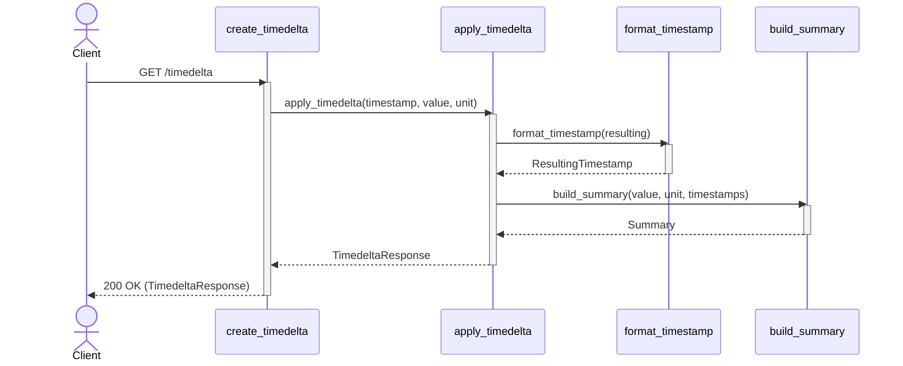
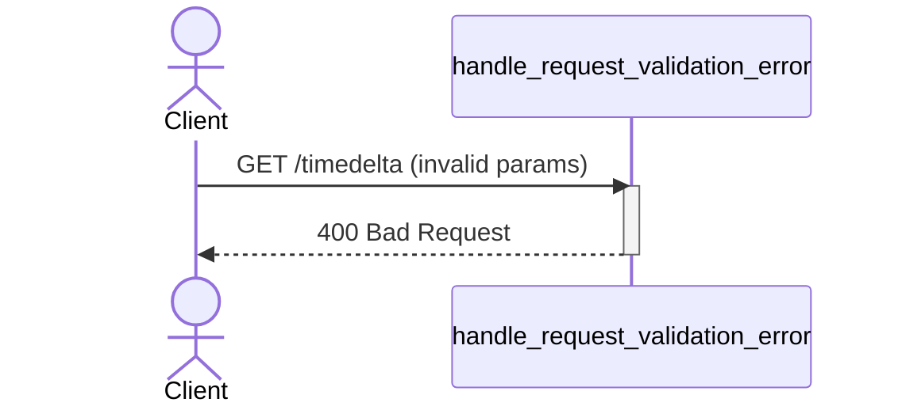

# Timedelta Service

The timedelta service allows users to add time to a timestamp, or subtract two timestamps.

## Getting Started

Define the port to run the service on:

```bash
export PORT=5000
```

**On Windows (PowerShell):**

```powershell
$env:PORT = 5000
```

Start the service using Docker:

```bash
docker compose up -d
```

Make a request:

```bash
TIMESTAMP=2026-01-01T00:00:00.000Z
curl "http://localhost:5000/timedelta?timestamp=$TIMESTAMP&operation=add&value=3&unit=days"
```

## Using the Service

Requests are made by a GET request to the service:

```http
GET /timedelta
```

### Request Parameters

Requests are made with the following parameters.

- `timestamp`: An ISO-formatted timestamp.
- `operation`: Must be `add`.
- `value`: Must be an integer. Can be positive or negative.
- `unit`: Must be one of `days`, `hours`, `minutes`, or `seconds`.

**Example Request:**

```plaintext
/timedelta?timestamp=2026-01-01T00:00:00.000Z&operation=add&value=3&unit=days
```

### Response Body

**Successful response:**

On a successful request, the service returns 200 OK and the values from the original response are returned, plus the `ResultingTimestamp` and a human-readable summary. For example:

```json
{
    "OriginalTimestamp": "2026-01-01T00:00:00.000Z",
    "Value": 3,
    "Unit": "days",
    "ResultingTimestamp": "2026-01-04T00:00:00.000Z",
    "Summary": "3 days after 2026-01-01T00:00:00.000Z is 2026-01-04T00:00:00.000Z"
}
```

**Error response:**

On an invalid request, the service returns 400 Bad Request and an error message:

```json
{
    "Error": "Message"
}
```

The message might be one of the following:

- Invalid timestamp. The timestamp must be an ISO-formatted timestamp.
- Invalid operation. Currently, only add is supported.
- Invalid value. The value must be an integer.
- Invalid unit. The unit must be one of days, hours, minutes, or seconds.

## UML Sequence Diagram

**Valid request:**



**Invalid request:**



## Testing
